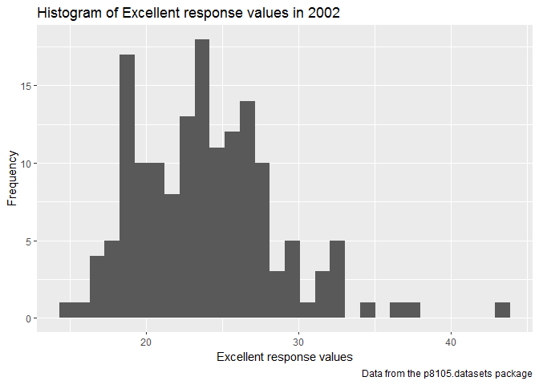
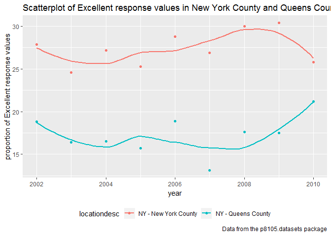

p8105\_hw2\_hx2264
================
Hongyao Xie
September 29, 2018

Problem 1
---------

``` r
#read and clean the data
transit_ori <- read_csv("./NYC_Transit_Subway_Entrance_And_Exit_Data.csv") %>%
  janitor::clean_names() 
```

    ## Parsed with column specification:
    ## cols(
    ##   .default = col_character(),
    ##   `Station Latitude` = col_double(),
    ##   `Station Longitude` = col_double(),
    ##   Route8 = col_integer(),
    ##   Route9 = col_integer(),
    ##   Route10 = col_integer(),
    ##   Route11 = col_integer(),
    ##   ADA = col_logical(),
    ##   `Free Crossover` = col_logical(),
    ##   `Entrance Latitude` = col_double(),
    ##   `Entrance Longitude` = col_double()
    ## )

    ## See spec(...) for full column specifications.

``` r
#retain line, station, name, station latitude / longitude, routes served, entry, vending, entrance type, and ADA compliance. Convert the entry variable from character (YES vs NO) to a logical variable
transit <- transit_ori[,c(2:18, 20, 23)]
transit[,"entry"] <- ifelse(transit[,"entry"] == "YES", TRUE, FALSE)
```

**Write a short paragraph about this dataset – explain briefly what variables the dataset contains, describe your data cleaning steps so far, and give the dimension (rows x columns) of the resulting dataset. Are these data tidy?**

There are 1868 rows and 19 columns in the resulting dataset after cleaning up. The 19 variables are: line, station\_name, station\_latitude, station\_longitude, route1, route2, route3, route4, route5, route6, route7, route8, route9, route10, route11, entrance\_type, entry, vending, ada. My data cleaning steps include: (1) convert column names to lower snake case; (2) select 19 required columns from the original dataset. (3) convert the entry variable from character to logical variable. The data isn't tidy so far as all routes were listed as separate variables.

``` r
nrow(distinct(transit, station_name, line, keep_all = TRUE))
```

    ## [1] 465

**How many distinct stations are there? **

There are 465 distinct stations.

``` r
ada_index <- which(transit[,"ada"] == TRUE)
transit_ada_true <- transit[ada_index,]
nrow(distinct(transit_ada_true, station_name, line, keep_all = TRUE))
```

    ## [1] 84

**How many stations are ADA compliant?**

There are 84 distinct stations that are ADA compliant.

``` r
vending_no_index <- which(transit[,"vending"] == "NO")
proportion_entrance <- length(which(transit[vending_no_index,"entry"] == TRUE))/ nrow(transit[vending_no_index,"entry"]) 
proportion_entrance
```

    ## [1] 0.3770492

**What proportion of station entrances / exits without vending allow entrance?**

About 37.70% of station entrances without vending allow entrance.

``` r
#reformat data so that route number and route name are distinct variables
transit_tidy <- gather(transit, key = route, value = name, route1:route11)

a_train_index <- which(transit_tidy[,"name"] == "A")
nrow(distinct(transit_tidy[a_train_index,], station_name, line, keep_ALL = TRUE))
```

    ## [1] 60

**How many distinct stations serve the A train?**

60 distinct stations serve the A train.

``` r
transit_tidy_a_train <- filter(transit_tidy[a_train_index,], ada == TRUE)
nrow(distinct(transit_tidy_a_train, station_name, line))
```

    ## [1] 17

**Of the stations that serve the A train, how many are ADA compliant?**

17 stations that serve the A train are ADA compliant.

Problem 2
---------

``` r
#specify the sheet in the Excel file and to omit columns containing notes and omit rows that do not include dumpster-specific data
wheel <- readxl::read_excel("./HealthyHarborWaterWheelTotals2018-7-28.xlsx", range = "A2:N336") %>%
  janitor::clean_names() %>%
  filter(!is.na(dumpster))
```

``` r
#round the number of sports balls to the nearest integer and converts the result to tan integer variable
wheel[,"sports_balls"] <- round(wheel[,"sports_balls"],digits = 0)

wheel[,"sports_balls"] <- as.integer(unlist(wheel[,"sports_balls"]))
```

``` r
#read the precipitation data
precip_2017 <- readxl::read_excel("./HealthyHarborWaterWheelTotals2018-7-28.xlsx", sheet = 4) %>%
  janitor::clean_names()

precip_2016 <- readxl::read_excel("./HealthyHarborWaterWheelTotals2018-7-28.xlsx", sheet = 5) %>%
  janitor::clean_names() 
```

``` r
#omit rows without precipitation data and add a variable year
prep_2017_index <- which(!is.na(precip_2017[,1]) & !is.na(precip_2017[,2]))
prep_2016_index <- which(!is.na(precip_2016)[,1] & !is.na(precip_2016[,2]))

precip_2016 <- precip_2016[prep_2016_index,]
precip_2017 <- precip_2017[prep_2017_index,]

precip_2016$year <- c(rep("2016",dim(precip_2016)[1]))
precip_2017$year <- c(rep("2017",dim(precip_2017)[1]))
```

``` r
#combine datasets and convert month to a character variable
precip_total <- rbind(precip_2016, precip_2017[2:dim(precip_2017)[1],])
precip_total <- precip_total[2:dim(precip_total)[1],]

precip_total[,1] <- as.numeric(unlist(precip_total[,1]))
precip_total[,1] <- month.name[unlist(precip_total[,1])]

colnames(precip_total) <- c("month", "precipitation", "year")

#the median number of sports balls in a dumpster in 2016
wheel_2016 <- na.omit(wheel[wheel$year == 2016,])
median(wheel_2016$sports_balls)
```

    ## [1] 26

The dimision of Mr. Trash Wheel dataset was 285 rows and 14 columns. The dataset recorded dumpster number, time of collection(year, month, date), amount of total litter, and litter type. The observation in 2016 precipitation dataset was 13 and the observation in 2017 precipitation dataset was 13. The key variable was month and year in the combined dataset. The total precipitation in 2017 was 32.93. The median number of precipitation in 2016 was 26.

Problem 3
---------

    ## Skipping install of 'p8105.datasets' from a github remote, the SHA1 (21f5ad1c) has not changed since last install.
    ##   Use `force = TRUE` to force installation

``` r
#load the data
data(brfss_smart2010)
brfss <- janitor::clean_names(brfss_smart2010)

#focus on the "Overall Health" topic
overall_health_index <- which(brfss[,"topic"] == "Overall Health")
brfss <- brfss[overall_health_index,]
```

``` r
#exclude variables for class, topic, question, sample size, and everything from lower confidence limit to GeoLocation
brfss <- brfss[,c(1:3, 7, 9)]
brfss_spread <- spread(brfss, key = response, value = data_value) %>%
  janitor::clean_names()

#create a new variable showing the proportion of resposnes that were "Excellent" or "Very Good"
brfss_spread$two_responses <- brfss_spread$excellent + brfss_spread$very_good
```

``` r
nrow(distinct(brfss_spread, locationdesc))
```

    ## [1] 404

``` r
nrow(distinct(brfss_spread, locationabbr))
```

    ## [1] 51

``` r
state_summary <- summary(as.factor(brfss_spread$locationabbr))
names(which.max(state_summary))
```

    ## [1] "NJ"

**How many unique locations are included in the dataset? Is every state represented? What state is observed the most?**

Totally 404 unique locations were included in the dataset. Every state was represented. NJ was observed the most.

``` r
brfss_exc_2002 <- filter(brfss, response == "Excellent" & year == 2002)
summary(brfss_exc_2002$data_value)[3]
```

    ## Median 
    ##   23.6

**In 2002, what is the median of the “Excellent” response value?**

The median of the Excellent response value in 2002 was 23.6.

**Make a histogram of “Excellent” response values in the year 2002**

``` r
brfss_spread %>%
  filter(., year == 2002) %>%
ggplot(., aes(x = excellent)) +
  geom_histogram() +
  labs(
    title = "Histogram of Excellent response values in 2002",
    x = "Excellent response values",
    y = "Frequency",
    caption = "Data from the p8105.datasets package"
  )
```

    ## `stat_bin()` using `bins = 30`. Pick better value with `binwidth`.

    ## Warning: Removed 2 rows containing non-finite values (stat_bin).



**Make a scatterplot showing the proportion of “Excellent” response values in New York County and Queens County (both in NY State) in each year from 2002 to 2010.**

``` r
brfss_NY <- filter(brfss_spread, locationdesc == "NY - New York County" | locationdesc == "NY - Queens County")


ggplot(brfss_NY, aes(x = year, y = excellent, color = locationdesc)) + 
  geom_point() +
  geom_smooth(se = FALSE) +
  labs(
    title = "Scatterplot of Excellent response values in New York County and Queens County from 2002 to 2010",
    x = "year",
    y = "proportion of Excellent response values",
    caption = "Data from the p8105.datasets package"
  ) +
  theme(legend.position = "bottom")
```

    ## `geom_smooth()` using method = 'loess' and formula 'y ~ x'


